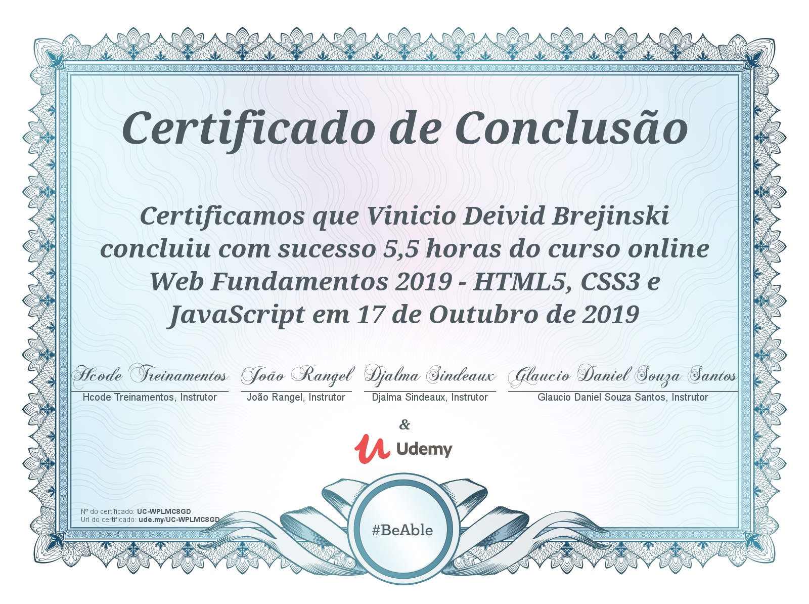
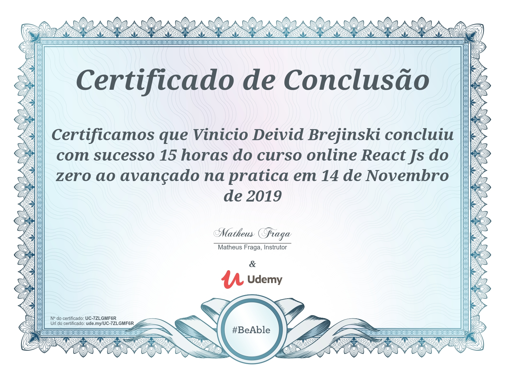
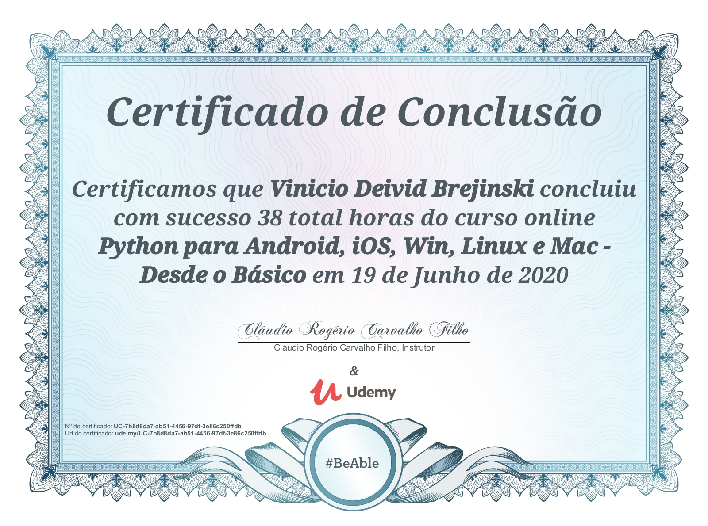
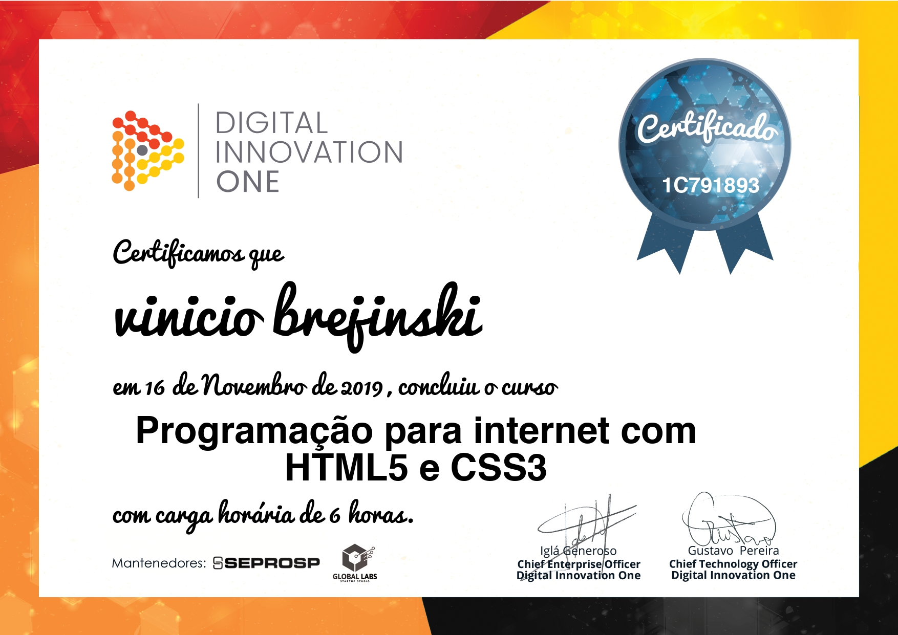

# Meus certificados
Este são alguns dos certificados obtidos por mim.

### HTML
 

### CSS

### JavaScript

### React Js

### React Native

### Python

### Flask

### PHP

## Certificados Digital Innovation One

### HTML5 - CSS3

### Bootstrap

### JavaScript

### Node Js

### React Js

### SCRUM

### Git e GitHub

## Certificados em outras áreas

### Hackathon CCR

### Networking Solution
